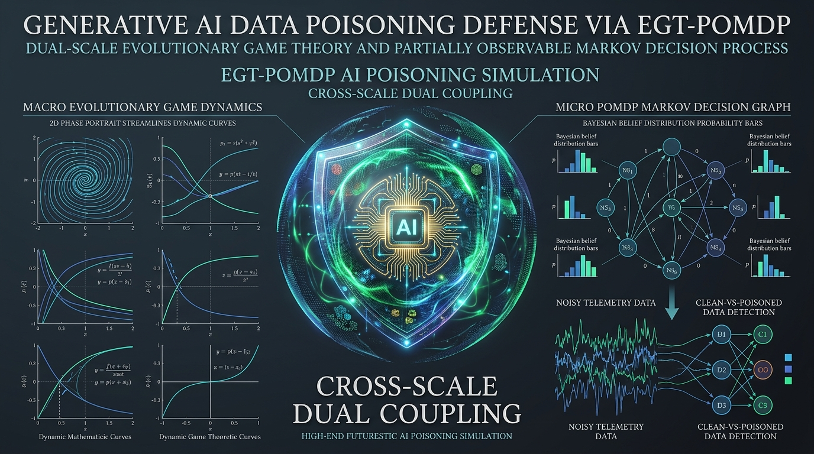
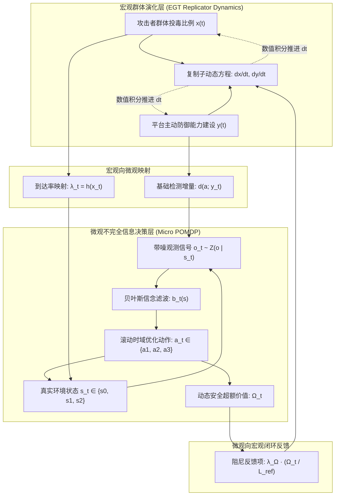

# EGT–POMDP 数据投毒演化博弈仿真平台
> **面向生成式人工智能数据投毒治理的宏微观双向耦合演化博弈仿真平台与实验方案验证系统**

<p align="center">
  
  
  
  
  
  
  
  
  
</p>

---

## 📋 项目简介

<p align="center">
  
  <br/>
  <em>图：面向生成式人工智能数据投毒的 EGT–POMDP 跨时间尺度双向耦合治理机制全景架构与动力学概念海报</em>
</p>

**EGT–POMDP 数据投毒演化博弈仿真平台** 是一套面向顶级期刊/学术会议标准的现代科研仿真与决策验证系统。该系统针对**生成式人工智能（Generative AI）基础模型预训练与持续增量微调阶段面临的隐蔽数据投毒威胁**，将**宏观演化博弈论（Evolutionary Game Theory, EGT）**与**微观部分可观测马尔可夫决策过程（Partially Observable Markov Decision Process, POMDP）**进行双向闭环耦合。

### 🌟 核心学术创新与理论突破
1. **打破传统演化博弈的极限环周期振荡**：
   借鉴朱建明等（2014《通信学报》）系统动力学攻防演化基础，经典对称/非对称纯 EGT 系统的中心点特征根为纯虚数，攻防双方呈现封闭极限环；本项目引入微观 POMDP 的动态安全超额价值增量 $\Omega_t$ 经 $L_{ref}$ 归一化反馈入宏观能力建设方程，注入了**正阻尼项（Damping Term）**，驱动相轨迹向内螺旋收敛至渐近纳什均衡点。
2. **解决不完全信息下的误报与高昂回滚成本矛盾**：
   在微观层，真实投毒状态 $s_t \in \{s_0, s_1, s_2\}$（安全、轻度、严重后门）无法直接探知。平台通过连续带噪观测序列 $o_t$ 实施**贝叶斯信念滤波更新（Bayesian Belief Update）**，实现常规检测、强化清洗与参数回滚重训的分层按需响应，有效压降假阳性惩罚 $C_{FP}$。
3. **嵌套消融实验与理论命题闭环验证**：
   系统内置 **6 大经典与对比消融模型**、**4 套标准论文实验套件**与 **Mulberry32 同源确定性伪随机数发生器**，实验证明双向耦合机制较单向耦合降低折现累计损失约 **3.6%**，较纯 POMDP 降低约 **27.2%**，并具备对非线性风险映射、高观测噪声及突发协同投毒冲击的卓越韧性。

---

## 🛠️ 技术栈

系统采用高内聚、模块化的前后端分离与科学计算跨语言架构，兼顾工业级交互体验与学术级计算严谨性。

### 1. 前端技术栈 (Frontend)

| 组件 / 库 | 版本 | 职责说明与技术特性 |
| :--- | :--- | :--- |
| **React** | `^19.0.1` | 前端渲染核心，利用 React 19 最新状态并发与细粒度响应特性 |
| **TypeScript** | `~5.8.2` | 静态强类型约束，全面保障博弈参数与张量状态定义的类型安全 |
| **Tailwind CSS** | `^4.1.14` | 全新 v4 引擎搭配 `@tailwindcss/vite`，实现学术深色科技风格设计 |
| **Vite** | `^6.2.3` | 新一代现代化前端构建工具与超快速热重载（HMR）开发服务器 |
| **Lucide React** | `^0.546.0` | 学术与科研级别可视化矢量图标组件库 |
| **Motion** | `^12.23.24` | 复杂图表切换、数据卡片展开与微交互物理平滑动效 |
| **HTML5 Canvas / SVG** | 原生标准 | 自研相平面相图、向量场流线与多层信念时序图的轻量级高性能渲染 |

### 2. 后端与运行时 (Backend & Runtime)

| 技术 / 组件 | 版本 | 职责说明与技术特性 |
| :--- | :--- | :--- |
| **Node.js** | `>=20.x` | 后端与构建基础设施运行环境 |
| **Express** | `^4.21.2` | 轻量级服务端支持，承载生产服务挂载与云容器化部署 |
| **tsx** | `^4.21.0` | TypeScript 零配置高速执行器，支持本地服务与脚本无缝热启 |
| **dotenv** | `^17.2.3` | 环境配置文件隔离解析（如 API Key、部署端口等） |
| **esbuild** | `^0.25.0` | 极速打包与编译辅助，优化生产分发体积 |

### 3. AI 服务与科学计算扩展 (AI & Computation Services)

| 服务 / 模块 | 技术定位 | 核心功能与应用场景 |
| :--- | :--- | :--- |
| **Google GenAI SDK** | `@google/genai ^2.4.0` | 服务端 Gemini API 桥接，支持自动化仿真参数推演与智能学术归纳 |
| **TS 原生数值积分引擎** | 内置自研算法 | 基于 Euler / RK4 的微分方程数值积分器，无第三方重型数学库依赖 |
| **Mulberry32 PRNG** | 内置确定性伪随机 | 确保 6 大消融模型在同源随机扰动下具备 100% 实验可复现性 |
| **Python 伴生科研出图** | Python 3.8+ (NumPy, SciPy, Matplotlib) | 内置一键导出学术论文专用绘图脚本，可直接生成出版级矢量图 (PDF/SVG) |

---

## 📁 目录结构

```text
EGT-POMDP/
├── .env.example               # 环境变量示例模版 (GEMINI_API_KEY, APP_URL 等)
├── .gitignore                 # Git 忽略配置
├── index.html                 # Web 应用入口 HTML 模版
├── metadata.json              # 项目元数据与云端运行时能力声明
├── package.json               # 项目依赖、脚本与元信息定义
├── tsconfig.json              # TypeScript 编译规则与路径映射
├── vite.config.ts             # Vite 构建、别名与 Tailwind 插件配置
└── src/                       # 核心业务源码目录
    ├── App.tsx                # 主应用程序入口：全局状态、导航栏、标签页管理
    ├── main.tsx               # DOM 挂载入口
    ├── index.css              # 全局样式基础与 Tailwind 主题引入
    ├── types.ts               # 全局数据契约：EGT/POMDP 参数、六模型类型、仿真记录定义
    ├── simulation/            # 仿真计算核心引擎
    │   └── engine.ts          # 数学推导：微分动力学、POMDP 评估、贝叶斯更新、蒙特卡洛测试
    └── components/            # 模块化学术功能组件
        ├── SchemeDocumentation.tsx  # 模块 1：仿真实验全景方案、论文命题映射与审稿答辩指南
        ├── PhasePortrait.tsx        # 模块 2A：宏观相平面轨线 (Phase Portrait) 与临界平衡点可视化
        ├── TimeSeriesChart.tsx      # 模块 2B：攻防演化时序曲线与动态价值阻尼衰减监控
        ├── MicroBeliefChart.tsx     # 模块 3：微观 POMDP 状态-信念-动作-损失联动时序图
        ├── AblationView.tsx         # 模块 4：6 大对比模型消融基准分析与 N 轮蒙特卡洛统计表
        ├── RobustnessView.tsx       # 模块 5：非线性风险映射、观测噪声扫描与突发冲击韧性恢复
        ├── ParameterPanel.tsx       # 交互控件：预设场景选择器与 20+ 细粒度参数微调滑块
        └── PythonExporter.tsx       # 导出套件：一键生成论文出图专用的 Python (Matplotlib) 代码
```

---

## ⚡ 核心功能模块和工作流程

平台聚焦学术全真实验闭环，各模块与论文章节严格对齐，形成完整的宏微观耦合推演工作流。

### 🔄 宏微观双向耦合架构与工作流程



### 🧬 6 大嵌套消融对比模型套件

为严谨拆解各机制的边际贡献，系统实现了 6 种对比模型并在同源随机种子序列下横向消融：

```
                    ┌──────────────────────────────────────┐
                    │    完全信息天花板 (Oracle Model)      │
                    │   (理想基准：无时延零误差直接获知真实状态)   │
                    └──────────────────┬───────────────────┘
                                       │ 引入观测噪声与不完全信息
                    ┌──────────────────▼───────────────────┐
                    │ ★ 双向耦合闭环模型 (Two-Way Coupling)  │
                    │  (本文核心创新：λ_Ω > 0 注入阻尼收敛)   │
                    └──────────────────┬───────────────────┘
                                       │ 令 λ_Ω = 0 (截断微观反馈)
                    ┌──────────────────▼───────────────────┐
                    │     单向耦合模型 (One-Way Coupling)   │
                    │  (宏观风险输入微观，但无微观反哺，呈极限环)│
                    └─────────┬──────────────────┬─────────┘
                              │                  │
               仅保留微观     │                  │ 仅保留宏观
       ┌──────────────────────▼──────┐    ┌──────▼──────────────────────┐
       │     仅 POMDP 模型 (POMDP Only)│    │     仅 EGT 模型 (Pure EGT)   │
       │ (外生假定静态攻击率，无群体博弈) │    │ (宏观粗暴调整，无微观信念滤波)│
       └─────────────────────────────┘    └─────────────────────────────┘
                              │                  │
                              └─────────┬────────┘
                                        │ 退化为传统静态规则
                    ┌───────────────────▼───────────────────┐
                    │     固定基线防御 (Fixed Baseline)      │
                    │      (全周期仅执行常规基础检测 a1)      │
                    └───────────────────────────────────────┘
```

### 📊 4 大核心学术实验套件

1. **宏观攻防演化轨迹与相图稳定性检验（实验一 · 对比朱建明 2014）**：
   - 绘制相平面轨线 $(x(t), y(t))$ 与向量场流线。
   - 观察单向耦合/纯 EGT 产生的闭合极限环周期振荡，对比双向耦合向内螺旋沉降至稳定内部均衡点 $(x_c, y_c)$ 的阻尼效应。
2. **6 大对比模型消融与综合治理成效对比（实验二 · 基准消融）**：
   - 包含 N 轮（默认 50 轮）蒙特卡洛抽样检验，输出平均累计折现损失、动作支出成本、假阳性误报惩罚及破坏损失明细。
   - 评估平衡准确率（Balanced Accuracy）与概率校准度（Brier Score），支持一键导出 Markdown 表格与 CSV。
3. **微观信念校准与动态分层处置决策机制（实验三 · POMDP 验证）**：
   - 真实隐状态 $s_t$、带噪观测 $o_t$、信念分布 $[b(s_0), b(s_1), b(s_2)]$ 与平台动作 $a_t$ 的严格时序对齐图。
   - 直观展示当 $b(s_2)$ 升高时平台精准触发高成本回滚清洗并在风险消除后退回常规检查的过程。
4. **非线性风险映射、观测噪声与突发投毒冲击鲁棒性检验（实验四 · 稳健性）**：
   - 支持线性、饱和指数与凸幂函数三种攻击到达率映射 $h(x)$ 的灵敏度对比。
   - 支持观测噪声方差 $\sigma \in [0.05, 0.35]$ 扫描。
   - 在 $t=30$ 时强行注入 $x=0.95$ 的突发协同投毒冲击，自动测算系统自愈周期（Recovery Steps）。

---

## ⚙️ 部署指南

### 1. 环境准备
- **Node.js**：v20.0.0 或更高版本
- **包管理器**：`npm` (v10+) 或 `pnpm` / `yarn`
- **可选 Python 环境**：Python 3.8+（若需本地运行导出的出图脚本，需 `pip install numpy scipy matplotlib`）

### 2. 获取代码与安装依赖
```bash
# 克隆仓库
git clone https://github.com/your-username/EGT-POMDP.git
cd EGT-POMDP

# 安装前端与服务依赖
npm install
```

### 3. 配置环境变量
在项目根目录下复制 `.env.example` 并重命名为 `.env`：
```bash
cp .env.example .env
```
根据需求配置环境变量：
```env
# 可选：Google Gemini AI 扩展能力 API Key（若无需 AI 辅助推演功能可不填）
GEMINI_API_KEY="YOUR_GEMINI_API_KEY_HERE"

# 外部访问域名或服务地址
APP_URL="http://localhost:3000"
```

### 4. 本地开发模式
启动本地 Vite 开发服务器（开启热重载与 host 暴露）：
```bash
npm run dev
```
打开浏览器访问：`http://localhost:3000`

### 5. 生产构建与本地预览
```bash
# 静态资源类型检查与生产环境打包
npm run build

# 预览生产构建包
npm run preview
```
打包生成的高性能静态资源将输出在 `dist/` 目录下，可直接由 Nginx、Caddy、Cloudflare Pages 或 Express 托管。

### 6. 容器化部署 (Docker 示例)
```dockerfile
FROM node:20-alpine AS builder
WORKDIR /app
COPY package*.json ./
RUN npm ci
COPY . .
RUN npm run build

FROM nginx:alpine
COPY --from=builder /app/dist /usr/share/nginx/html
EXPOSE 80
CMD ["nginx", "-g", "daemon off;"]
```

---

## 📦 API 接口与计算引擎

平台核心计算逻辑高内聚封装于 `src/simulation/engine.ts` 中，既支持前端高性能零延迟直接调用，亦可解耦封装为后端微服务 REST API。

| 函数 / 接口名称 | 输入参数 | 返回值 / 产出格式 | 功能与学术职责说明 |
| :--- | :--- | :--- | :--- |
| `runSimulation()` | `(modelType, egt, pomdp, config, seed?)` | `ModelSimulationResult` | **单次全周期仿真运行**：执行宏观连续推进与微观离散观测，生成单步记录表、综合损失与稳定性评估 |
| `runMonteCarloBenchmark()` | `(egt, pomdp, config, runs=50)` | `ModelMonteCarloStats[]` | **N 轮蒙特卡洛统计基准**：严密复现论文第 6 章，输出 6 大模型的期望损失、标准差、分项开销及校准指标 |
| `runRobustnessSweep()` | `(egt, pomdp, config)` | `RobustnessTestResult` | **全套稳健性与冲击扫描**：包括 3 类映射对比、5 级观测噪声敏感性分析及突发外部投毒冲击恢复测试 |
| `calculateEGTDerivatives()`| `(x, y, omegaNorm, egt)` | `{ dxdt, dydt }` | **宏观复制子动态导数求解**：计算 $\frac{dx}{dt}$ 与注入 POMDP 阻尼反馈的 $\frac{dy}{dt}$ |
| `evaluatePOMDPActions()` | `(belief, x, y, egt, pomdp, horizon=2)` | `{ bestAction, qValues, omegaT, omegaNorm }`| **微观滚动时域决策评估**：基于信念计算动作 Q 值，并根据公式 (14) 计算动态安全超额价值增量 $\Omega_t$ |
| `updateBelief()` | `(prior, action, obs, T, Z)` | `[b0, b1, b2]` | **贝叶斯信念滤波**：结合状态转移先验与观测混淆似然，完成状态后验信念分布概率更新 |
| `computeCriticalPoints()` | `(egt)` | `{ pc, xc, yc }` | **理论平衡中心点推演**：根据博弈收益矩阵闭式解析理论内部鞍点/中心点 $(x_c, y_c)$ 与临界检测率 $p_c$ |
| `buildTransitionMatrix()` | `(action, x, y, egt)` | `number[3][3]` | **动态马尔可夫转移矩阵构造**：依据当前动作及宏观到达率构建状态迁移张量 $T(s' \| s, a)$ |
| `getObservationProbabilities()` | `(action, noise)` | `number[3][3]` | **带噪观测似然矩阵构造**：生成不同环境污染程度下的观测混淆概率分布矩阵 $Z(o \| s')$ |
| `createPRNG()` | `(seed=42)` | `() => number` | **Mulberry32 伪随机数发生器**：生成 $[0, 1)$ 高质量均匀分布，确保不同模型消融对比的完全可复现性 |

---

## 💡 总结与展望

### 📌 理论价值与学术贡献
- **跨尺度闭环范式**：突破了传统安全博弈中宏观群体与微观动作割裂的局限，首次在生成式 AI 数据投毒语境下完成了“群体演化 $\leftrightarrow$ 动态阻尼 $\leftrightarrow$ 部分可观测马尔可夫决策”的双向数理闭环。
- **消弭系统发散振荡**：从动力系统数学本质上证明了引入微观动态信息价值能将纯演化博弈的虚轴特征根向左半平面推动，提供了网络安全攻防演化领域从“无休止内生震荡”走向“渐近稳态收敛”的经典示范。
- **论文级可复现性支撑**：系统内置完备的消融对比、参数敏感性测试以及一键 Python 矢量绘图导出，极大降低了顶级学术论文的实验设计门槛。

### 🚀 后续演进与未来展望
1. **多智能体强化学习（MARL）微观下沉**：未来可将微观 POMDP 求解升级为更复杂的深度循环 Q 网络（DRQN）或多智能体 Actor-Critic 算法，适配异构攻击者集群。
2. **大模型后门检测真实数据驱动接入**：引入 LLM 实际微调场景下的持续特征监测数据（如困惑度困惑差值、激活聚类偏差、梯度异常范数等），直接驱动 $Z(o|s)$ 矩阵的在线自适应标定。
3. **分布式仿真云端调度**：针对更大规模的高维蒙特卡洛与超参数扫网，构建基于 WebWorker 多线程并行或云端 Serverless 算力节点的分布式实验调度管线。

---

<p align="center">
  <b>EGT–POMDP 数据投毒演化博弈仿真平台</b> · 致力于构建可信可靠的下一代生成式人工智能安全治理体系
</p>
